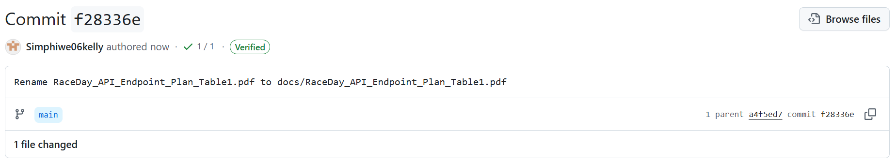

# RaceDay

RaceDay is a full-stack, cloud-aware event management system built for the South African road running, walking, and cycling community. It replaces the paper-based registration and spreadsheet processes many community events still rely on, giving Event Organisers a way to create and manage events, categories, and results, while Participants can browse upcoming events, enter them, track their personal performance history, and prepare for race day using live weather and route information.

This repository is a Portfolio of Evidence (POE) built progressively across three parts for the PROG6212 module:

- **Part 1** — System planning: Entity Relationship Diagram, API endpoint plan, and SQL database script.
- **Part 2** — A RESTful API built in C#, connected to the database, with unit tests and GitHub Actions CI/CD. *(Not yet built.)*
- **Part 3** — An MVC web application that consumes the API, integrates Azure Blob Storage, and is containerised with Docker. *(Not yet built.)*

## Roles

RaceDay supports two distinct user roles:

- **Organiser** — can create, edit, and delete events; manage event categories; capture participant results; and view all enrolments for their events.
- **Participant** — can create an account, browse events, enter an event by selecting a category, view their own enrolments, and track their own results.

Role-based access is planned at the API level for Part 2 and will be reflected consistently in the MVC interface in Part 3.

## Repository structure

```
RaceDay/
├── .github/
│   └── workflows/
│       └── ci.yml                  # Validates that /docs contains the required Part 1 files
├── docs/
│   ├── RaceDay_ERD.png             # Entity Relationship Diagram (Section A)
│   ├── API_Endpoint_Plan.md        # API endpoint plan (Section B)
│   └── RaceDay_Database.sql        # Database creation + seed script (Section C)
└── README.md
```

## Part 1 — Planning

### Entity Relationship Diagram
See [`docs/RaceDay_ERD.png`](docs/RaceDay_ERD.png). Six entities: `Users`, `Venues`, `Events`, `Categories`, `Enrolments`, `Results`. `Users` holds both Organisers and Participants, distinguished by a `Role` column. All relationships are one-to-many, with `Enrolments` → `Results` enforced as one-to-one via a unique foreign key constraint.

### API Endpoint Plan
See [`docs/API_Endpoint_Plan.md`](docs/API_Endpoint_Plan.md). Covers Authentication, User Profile, Events, Categories, Enrolments, and Results — 20 endpoints in total, each specifying HTTP method, route, description, required role, request body, and expected response (including failure cases).

### SQL Database Script
See [`docs/RaceDay_Database.sql`](docs/RaceDay_Database.sql). Creates the `RaceDayDB` database and all six tables with primary keys, foreign keys, and constraints, then seeds it with sample data (2 Organisers, 2 Participants, 3 Events, 5 Categories, 4 Enrolments, 2 Results).

## Setup instructions

### Prerequisites
- SQL Server (Developer or Express edition) and SQL Server Management Studio (SSMS)

### Running the database script
1. Clone this repository:
   ```
   git clone <your-repo-url>
   ```
2. Open `docs/RaceDay_Database.sql` in SSMS.
3. Connect to your local SQL Server instance.
4. Select the entire script (Ctrl+A) and execute it (F5) — **run it top to bottom in one go**, not in separate pieces, so the `USE RaceDayDB;` context is set correctly before the tables and seed data are created.
5. The script drops and recreates `RaceDayDB` if it already exists, so it's safe to re-run from scratch at any time.

*(Setup instructions for the API and MVC application will be added here in Parts 2 and 3.)*

## CI/CD

A GitHub Actions workflow (`.github/workflows/ci.yml`) validates that the `/docs` folder exists and contains the required planning files.

**Build status:**



*(Replace the image above with an actual screenshot of your green GitHub Actions run before submitting.)*

## Video walkthrough

Part 1: [Unlisted YouTube link] *(paste your video link here)*

## AI assistance disclosure

Parts of the planning documentation (ERD structure, API endpoint plan, and SQL script) and this README were drafted with the assistance of an AI tool (Claude) and then reviewed, tested, and understood by the author before submission. All design decisions were evaluated and can be explained and justified independently, as demonstrated in the accompanying video.
